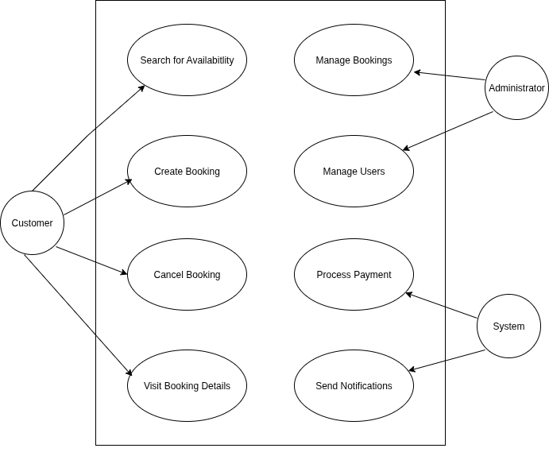

# Requirement Analysis in Software Development

## Introduction

This repository contains the deliverables for the **Requirement Analysis Project** focusing on the development of a **Booking Management System**. The purpose of this repository is to demonstrate the process of gathering, documenting, and analyzing requirements to create a solid foundation for software development.

The project emphasizes real-world application of requirement analysis principles, including identifying functional and non-functional requirements, creating visual representations using diagrams, and defining clear acceptance criteria. By following this structured approach, the project aims to ensure clarity, precision, and alignment with business and user goals in the early stages of the Software Development Life Cycle (SDLC).

## What is Requirement Analysis?

**Requirement Analysis** is a critical phase in the Software Development Life Cycle (SDLC) that involves gathering, analyzing, and documenting the needs and expectations of stakeholders for a software system. It serves as the foundation for designing, developing, and deploying software that aligns with business goals and user needs.

During this phase, business analysts, project managers, and development teams collaborate with stakeholders to understand what the system should do (functional requirements) and how it should perform (non-functional requirements). The process may include interviews, surveys, workshops, brainstorming sessions, and the use of modeling tools to capture and visualize requirements.

### Importance of Requirement Analysis in SDLC:
- **Defines Project Scope:** Clearly outlines what is in and out of scope to prevent scope creep.
- **Aligns Stakeholder Expectations:** Ensures that everyone involved has a shared understanding of the project goals and deliverables.
- **Guides Design and Development:** Provides the technical team with precise guidelines to build the right solution.
- **Reduces Risks:** Early identification of potential issues and requirements gaps minimizes costly changes later in development.
- **Supports Quality Assurance:** Helps in defining acceptance criteria for testing and validation.
- **Optimizes Resources:** Ensures that time, budget, and effort are directed toward features that deliver the most value.

A thorough Requirement Analysis is essential for the success of any software project, as it lays the groundwork for all subsequent phases, including design, development, testing, and deployment.

## Why is Requirement Analysis Important?

Requirement Analysis plays a vital role in the success of software development projects. Below are three key reasons why it is critical in the Software Development Life Cycle (SDLC):

### 1. Prevents Scope Creep and Misalignment
Clear and thorough requirement analysis helps define the exact scope of the project from the beginning. By setting clear boundaries and expectations, it minimizes the risk of scope creep—where uncontrolled changes or continuous growth in project scope can lead to delays, increased costs, or project failure.

### 2. Ensures Stakeholder Satisfaction
Engaging stakeholders during the requirement analysis phase ensures that the final product meets their needs and expectations. By accurately capturing user requirements, the development team can build a system that delivers real value and achieves business objectives.

### 3. Reduces Development Costs and Risks
Identifying and addressing potential issues early in the project reduces the likelihood of costly changes and rework during later stages of development. A well-executed requirement analysis phase helps in making informed decisions, optimizing resources, and avoiding unnecessary delays.

By investing time and effort in Requirement Analysis, teams can set a solid foundation for successful software delivery that meets both technical and business goals.

## Key Activities in Requirement Analysis

The Requirement Analysis process consists of several essential activities that help ensure a thorough understanding and documentation of the project’s needs. Below are the five key activities involved:

- **Requirement Gathering**
  - Involves collecting information from stakeholders, end-users, and subject matter experts to understand their needs and expectations.
  - Techniques include interviews, surveys, questionnaires, and workshops.

- **Requirement Elicitation**
  - Focuses on uncovering, clarifying, and refining requirements through collaboration and communication with stakeholders.
  - May involve brainstorming, use case analysis, and prototyping to extract detailed requirements.

- **Requirement Documentation**
  - Involves creating clear and comprehensive documentation such as Software Requirements Specifications (SRS), user stories, and use case diagrams.
  - Ensures that all gathered requirements are recorded and communicated effectively to the development team.

- **Requirement Analysis and Modeling**
  - Analyzing requirements to identify relationships, dependencies, priorities, and potential risks.
  - Often includes the use of visual models like flowcharts, data models, and use case diagrams to represent the system structure and behavior.

- **Requirement Validation**
  - Ensures that the documented requirements accurately reflect stakeholder needs and are feasible, complete, and testable.
  - Typically involves review sessions, walkthroughs, and feedback loops with stakeholders.

These activities collectively form the backbone of the Requirement Analysis phase, setting the stage for successful design, development, and delivery of software solutions.

## Types of Requirements

In Requirement Analysis, understanding the distinction between **Functional** and **Non-functional Requirements** is crucial for building a well-rounded and effective software solution. Below are definitions and examples of both types in the context of the **Booking Management System** project.

### Functional Requirements

Functional Requirements define **what the system should do**—the specific behaviors, features, and functions the system must support to meet user and business needs.

**Examples for the Booking Management System:**
- Users must be able to **create an account and log in securely**.
- The system should allow users to **search for available properties based on location, date, and price**.
- Users should be able to **book a property and receive confirmation via email**.
- Administrators must be able to **add, edit, or remove property listings**.
- The system should enable users to **view and manage their bookings**.

### Non-functional Requirements

Non-functional Requirements describe **how the system should perform** rather than specific behaviors. These requirements focus on system qualities such as performance, usability, reliability, and security.

**Examples for the Booking Management System:**
- The system must load property search results **within 2 seconds**.
- The application must be **accessible on mobile, tablet, and desktop devices**.
- All user data must be **encrypted and comply with data protection regulations**.
- The system should be able to handle **up to 1,000 concurrent users without performance degradation**.
- The platform must maintain **99.9% uptime availability**.

Both types of requirements are essential for ensuring the success of the project—functional requirements deliver the core features, while non-functional requirements ensure a smooth and satisfactory user experience.

## Use Case Diagrams

**Use Case Diagrams** are visual representations used in Requirement Analysis to illustrate the interactions between different types of users (actors) and the system. They help to identify the key functionalities the system must provide and the external entities involved.

### Benefits of Use Case Diagrams:
- Provide a **clear visual overview** of the system’s functional requirements.
- Help in identifying **actors** (users or external systems) and their **interactions** with the system.
- Support communication between **stakeholders** and **development teams** by simplifying complex requirements.
- Aid in identifying missing requirements and **refining system scope**.

### Use Case Diagram for Booking Management System

Below is the Use Case Diagram for the **Booking Management System**, which identifies key actors and their interactions with the system’s functionalities:

**Actors:**
- **User (Customer)**
- **Administrator**
- **Payment Gateway** (External System)

**Key Use Cases:**
- Register an Account
- Log In
- Search for Properties
- Book Property
- Make Payment
- Receive Booking Confirmation
- Manage Listings (Admin)
- Manage Bookings (User)
- View Booking History

## Acceptance Criteria

**Acceptance Criteria** are specific conditions that a software feature or requirement must meet to be considered complete and acceptable by stakeholders. They act as a bridge between business needs and technical implementation, ensuring that all parties have a shared understanding of what success looks like for each feature.

### Importance of Acceptance Criteria in Requirement Analysis:
- **Clarify Expectations:** They provide a clear definition of what needs to be delivered, reducing ambiguity between clients, users, and developers.
- **Guide Development:** Developers use acceptance criteria as a checklist to ensure that the feature behaves as expected.
- **Support Testing:** Testers use acceptance criteria to verify that the delivered functionality meets the specified requirements.
- **Facilitate Sign-off:** Stakeholders can easily validate that the system meets business needs before moving forward.

### Example: Acceptance Criteria for Checkout Feature (Booking Management System)

**Feature:** Checkout and Payment for Booking

**Acceptance Criteria:**
1. User must be able to review booking details before proceeding to checkout.
2. The system must calculate the total cost, including taxes and applicable fees.
3. The user must be able to select a payment method (e.g., credit card, PayPal).
4. Payment must be processed securely through the integrated Payment Gateway.
5. Upon successful payment, the user must receive a booking confirmation on-screen and via email.
6. If payment fails, the system must display an appropriate error message and allow retry.

Establishing clear acceptance criteria like the above ensures that both technical teams and business stakeholders are aligned on what the feature must deliver to be considered successful.
